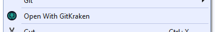

# Open With GitKraken

A Visual Studio Extension that opens the associated git repo of a project or solution with GitKraken.

Download the latest version from the [Visual Studio Gallery](https://visualstudiogallery.msdn.microsoft.com/)

## How it looks

The extension adds an `Open With GitKraken` entry to the right-click context menu of a project and solution item in the Solution Explorer.

## How it works

The extension will check if the selected solution explorer item has an associated git repository by looking for the `.git` folder. If a `.git` folder is found, the repository will be opened with GitKraken.

When you selected a project item that does not have an associated git repository, an extra check for a git repository is made on solution level. If a `.git` folder is found at solution level, this one will be opened with GitKraken.

## Prerequisite

At the risk of stating the obvious, you need to have GitKraken installed at its default installation location.

## Supported versions

- Visual Studio 2017
- Visual Studio 2019

## Why

This extension came to life because I am an avid GitKraken user and always missed the integration with Visual Studio. At some point I was tired of doing the same manual process ( isn't this how ALL good developer ideas come to life? ) to open my repository in GitKraken so I decided to automate things a bit. Instead of just building something for myself I decided to put some more effort in it and make it an official marketplace extension. This way I hope that it will be of use to a few more people than just me.

## Contributing

Please, feel free to contribute. I would suggest creating a new issue if you encounter any bug or weird glitch. Also, when you think of a nice improvement/feature, start the discussion in the issues section or fire up a PR.

## Shoutouts

This plugin was released with the approval of the awesome people at [GitKraken](https://www.gitkraken.com/). I am in no way affiliated with them, I am just a big fan of their git client.

I was already aware that [Mads Kristensen](https://github.com/madskristensen) was the unspoken king of Visual Studio Extensions but during my adventures in VSIX-land I often landed on some blog post or plugin from him. Specifically, his [OpenCommandLine](https://github.com/madskristensen/OpenCommandLine) extension, of which I am a happy user myself, helped me a lot. Thanks.

## License

[MIT](LICENCE)
